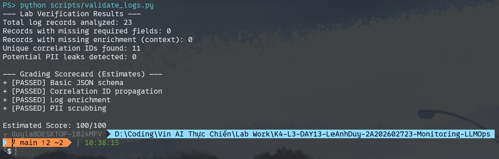
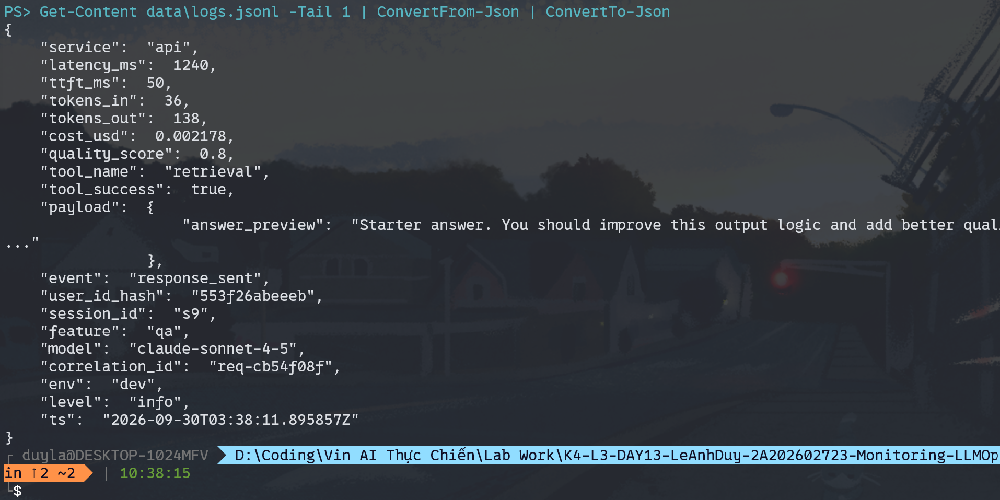
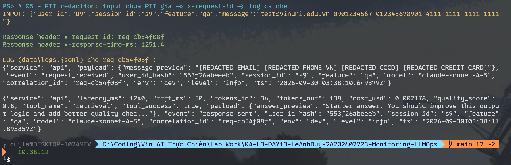
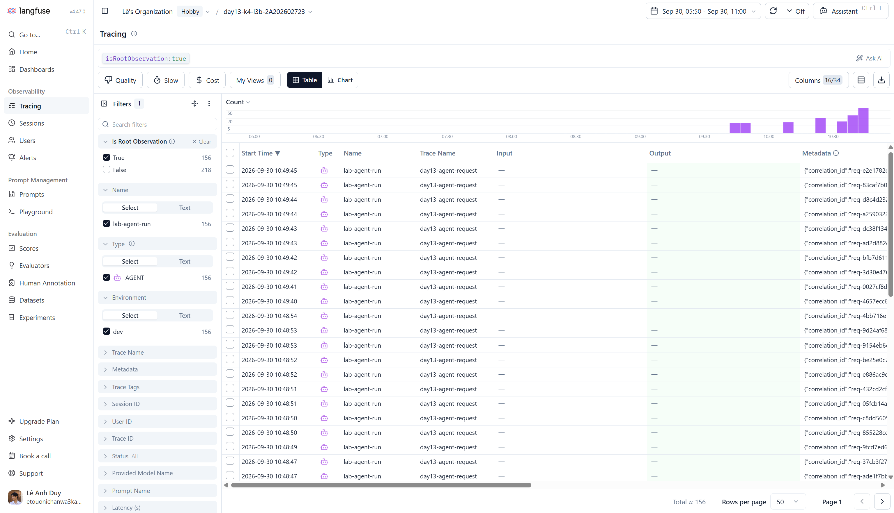
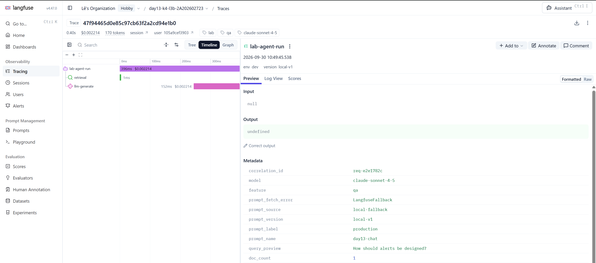
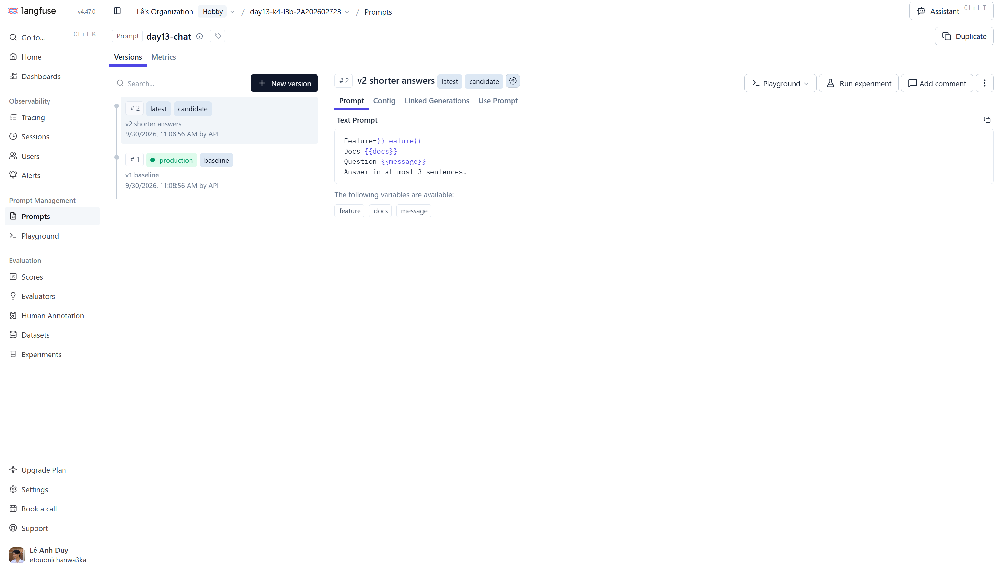
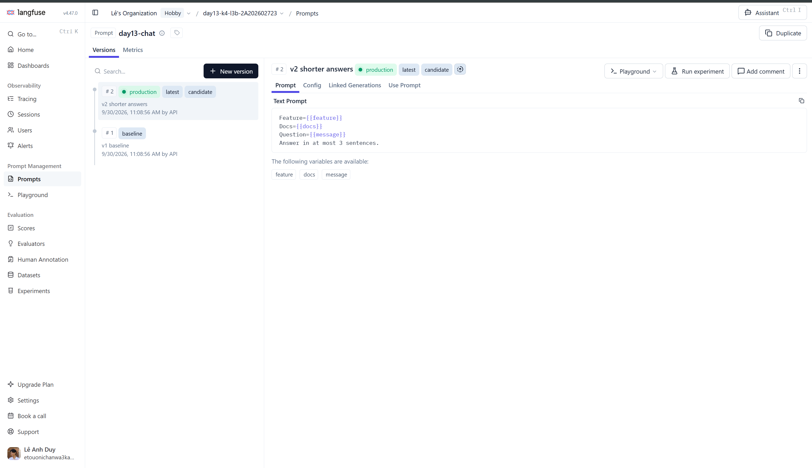
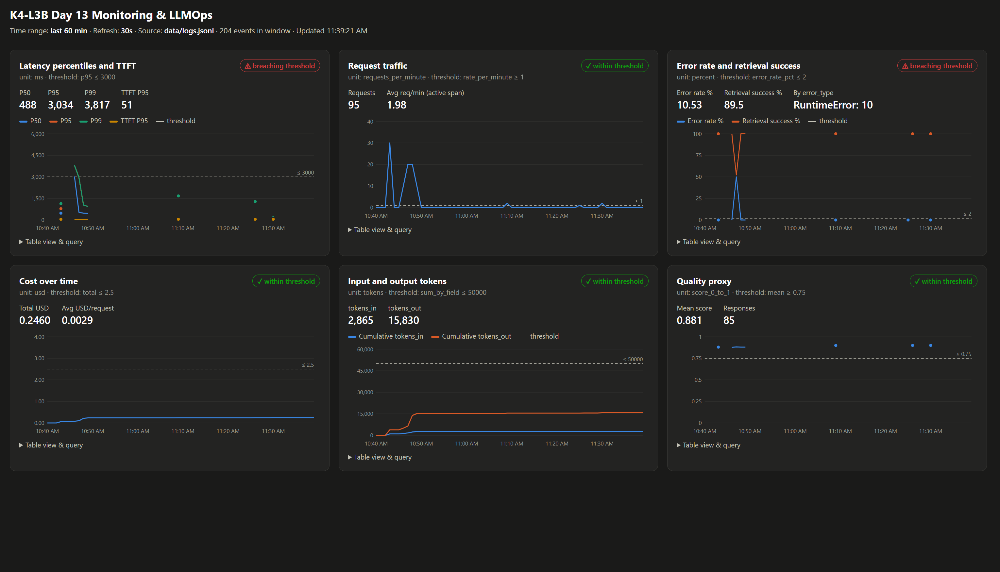

# Báo cáo cá nhân — K4-L3B Day 13 Monitoring & LLMOps

> Mỗi học viên hoàn thiện một file duy nhất này. Khi dẫn evidence, dùng đường dẫn tương đối, ví dụ `evidence/07-trace-waterfall.png`.

## 1. Thông tin học viên

- **Họ và tên:** Lê Anh Duy
- **MSSV:** 2A202602723
- **Lớp:** K4-L3B
- **Repository URL:** https://github.com/Le-Anh-Duy/K4-L3-DAY13-LeAnhDuy-2A202602723-Monitoring-LLMOps
- **Commit SHA cuối:**
- **Challenge ID:**
- **Tên project Langfuse cá nhân:** `day13-k4-l3b-2A202602723`

## 2. Evidence index

Điền đúng đường dẫn tới evidence thực tế. Có thể đổi tên hoặc dùng nhiều ảnh nếu cần.

| Evidence | Đường dẫn |
|---|---|
| Pytest cuối | `evidence/01-pytest.png` |
| Log validator | `evidence/02-log-validator.png` |
| Dashboard validator | `evidence/03-dashboard-validator.png` |
| Structured log | `evidence/04-structured-log.png` |
| PII redaction | `evidence/05-pii-redaction.png` |
| Trace list | `evidence/06-trace-list.png` |
| Trace waterfall | `evidence/07-trace-waterfall.png` |
| Trace metadata | `evidence/08a-trace-generation.png`, `evidence/08b-trace-metadata.png` |
| Prompt versions | `evidence/09-prompt-versions.png` |
| Prompt rollback | `evidence/10a-prompt-promoted.png`, `evidence/10b-prompt-rolled-back.png` |
| Dashboard runtime | `evidence/11-dashboard-overview.png` |
| Incident metric | `evidence/12-incident-metric.png` |
| Incident log | `evidence/13-incident-log.png` |
| Incident trace | `evidence/14-incident-trace.png` |

## 3. Kết quả kỹ thuật

| Nội dung | Baseline | Kết quả cuối | Nhận xét |
|---|---|---|---|
| `validate_logs.py` | 30/100 (41 records, 40 thiếu field/enrichment, 0 correlation ID) | | Baseline còn TODO logging |
| `validate_dashboard.py` | HỢP LỆ: 6/6 panel (contract) | | Chỉ kiểm tra contract YAML |
| `pytest` | 22 passed | | Chạy bằng `.venv` |
| Số traces hợp lệ | 0 child span (chỉ root) | 156 traces có retrieval + generation | [06-trace-list](evidence/06-trace-list.png) |
| Số PII leak | 0 | | Theo `validate_logs.py` |
| Latency P95 / TTFT P95 | 785ms / 50ms (30 request, concurrency 1 và 5) | | Đo bằng `/metrics` trước practice incident |
| Retrieval success rate | 100% | | `tool_success` trong `response_sent` |

## 4. Logging và PII

- **Cách tạo/nhận và truyền correlation ID:** `CorrelationIdMiddleware` gọi `clear_contextvars()` đầu mỗi request, chỉ nhận `x-request-id` từ client nếu đúng format `req-<8 hex>` (tránh header injection), ngược lại sinh mới bằng `uuid4`. ID được bind vào structlog contextvars, lưu ở `request.state`, truyền vào trace metadata và trả lại qua header `x-request-id` cùng `x-response-time-ms`.
- **Các metadata được ghi vào structured log:** `/chat` bind `user_id_hash` (SHA-256, 12 ký tự), `session_id`, `feature`, `model`, `env`; mọi log line trong request tự có các field này cùng `correlation_id`, `ts`, `level`.
- **Cách bảo đảm PII được scrub trước khi ghi:** processor `scrub_event` được đăng ký trước `JsonlFileProcessor`, nên payload đã được redact trước khi serialize xuống file. Pattern: email, thẻ (đặt trước CCCD/phone để redact nguyên số 16 chữ số), CCCD, phone VN, passport VN.
- **Cách kiểm chứng kết quả:** `validate_logs.py` từ 30/100 lên 100/100 (0 PII leak, 11 correlation ID). Test mới trong `tests/test_pii.py` và `tests/test_chat_observability.py`. Thêm test cho trường hợp CCCD đứng ngay trước số thẻ: phiên bản pattern thẻ đầu tiên khớp nhầm `<cccd> 4111` thành thẻ và để lộ 12 chữ số còn lại, nên pattern thẻ giờ bắt buộc cùng một loại dấu phân cách trong cả 4 nhóm. Evidence: [`evidence/cp0_baseline.txt`](evidence/cp0_baseline.txt), [`evidence/cp1_logging_pii.txt`](evidence/cp1_logging_pii.txt).

## 5. Tracing và prompt versioning

- **Cách xác nhận traces do chính tôi tạo trong project cá nhân:** mọi trace nằm trong project `day13-k4-l3b-2A202602723`, do `load_test.py` và request thủ công của tôi tạo ra ngày 2026-09-30. Lọc `isRootObservation:true` ra 156 traces `day13-agent-request`, mỗi trace có `correlation_id` trùng với log line trong `data/logs.jsonl`.

- **Cấu trúc root/retrieval/generation observations:** `lab-agent-run` (agent, root) → `retrieval` (retriever, method `LabAgent._retrieve` dùng `@observe` nên tự đánh level ERROR khi retrieval raise) và `llm-generate` (generation, có model, prompt link, `usage_details` input/output, `cost_details`, `completion_start_time` cho TTFT). Input/output chỉ là preview 80 ký tự đã scrub; client Langfuse được tạo với `mask=mask_pii` làm lưới an toàn cho mọi input/output/metadata.
- **Cách nối trace với log:** `correlation_id` của request được đưa vào trace metadata qua `propagate_attributes`; search ID đó trên Langfuse ra đúng trace của log line.
- **Trace mẫu:** `47f94465d0e85c97cb63f2a2cd94e1b0` (`correlation_id=req-e2e1782c`), 396ms, $0.002214, 170 tokens.

- **Prompt name:** `day13-chat` (text prompt, tạo và đổi label bằng SDK qua [`scripts/prompt_versions.py`](../scripts/prompt_versions.py)).
- **Version/label baseline:** v1, labels `baseline` + `production`: template gốc `Feature/Docs/Question`.
- **Version/label candidate:** v2, label `candidate`: thêm dòng `Answer in at most 3 sentences.`
- **Trace ID của mỗi version:** cùng input `What is your refund policy?`, server chạy với `LANGFUSE_PROMPT_LABEL` tương ứng:
  - baseline → v1: `19b0ec6adb6e006833929952abf432d4` (`req-38e156ee`), generation link `day13-chat` v1, 28/169 tokens.
  - candidate → v2: `6acf94396957ee42d5d6dab4babc8034` (`req-084976a7`), generation link `day13-chat` v2, 35/109 tokens.
- **Cách promote và rollback `production`:** `python scripts/prompt_versions.py promote` gọi `update_prompt(version=2, new_labels=["candidate", "production"])`; label là duy nhất trong một prompt nên Langfuse tự gỡ `production` khỏi v1. App không cần sửa code hay restart: sau khi cache prompt 60s hết hạn, request `req-1c9da6eb` qua label `production` đã dùng v2 (trace `6607b0f61d094db4ad9d5acd9b5b6b2b`). Rollback bằng `python scripts/prompt_versions.py rollback` (`production` về v1). Request đầu tiên sau khi cache hết hạn (`req-c9241541`, trace `934fd0148770f2e4e21ba99e516541e1`) vẫn dùng v2, vì cache prompt của SDK là stale-while-revalidate: trả bản cũ rồi mới tải lại ở nền. Request kế tiếp (`req-7622a467`, trace `d9c4b6b52e7907127ef84c9bfc6e0cdb`) đã dùng v1. Nghĩa là trong vận hành, rollback prompt mất tối đa khoảng 60s cộng thêm một request mới có hiệu lực; nếu cần nhanh hơn thì giảm `cache_ttl_seconds`.

## 6. Dashboard, SLO và alerts

- **Dashboard và sáu panel:** `python scripts/dashboard.py` → http://127.0.0.1:8050. Script chỉ dùng stdlib + PyYAML, đọc `config/dashboard.yaml` (title, time range 60 phút, refresh 30s, unit, threshold) và tính lại từ `data/logs.jsonl` mỗi lần refresh; percentile dùng lại `app.metrics.percentile`. Mỗi panel có stat tổng cửa sổ, badge đạt/vượt threshold, biểu đồ theo phút có đường threshold, tooltip và bảng dữ liệu. Đã kiểm tra runtime bằng 3 practice scenario: `rag_slow` đẩy P99 lên ~3.8s (vượt 3000ms), `tool_fail` làm error rate 100% và retrieval success 0% trong phút đó (10 span retrieval ERROR trên Langfuse), `cost_spike` làm tokens_out tăng dốc.

- **SLO và lý do chọn:** giữ `latency ≤ 3000ms` cho 99.5% request trong 28 ngày. Baseline (30 request): P50 475ms, P95 785ms, P99 1136ms, TTFT P95 50ms, 0 lỗi; 3000ms cao gấp ~2.6 lần P99 nên không báo động giả, nhưng vẫn bắt được retrieval chậm (+2.5s). Xem [`config/slo.yaml`](../config/slo.yaml).
- **Cách tính error budget:** 100% − 99.5% = 0.5%. Với 10,000 request / 28 ngày thì tối đa 50 request được phép lỗi hoặc chậm hơn 3000ms. Một đợt `tool_fail` như lúc practice (10 request lỗi liên tiếp) đã tiêu 20% budget đó.
- **Ba alert và runbook tương ứng:** [`config/alert_rules.yaml`](../config/alert_rules.yaml), [`docs/alerts.md`](../docs/alerts.md), đều gửi Slack `#k4-l3b-alerts`: `HighLatencyP95` (warning, P95 > 3000ms trong 5m), `HighErrorRateOrRetrievalFailing` (critical, error rate > 2% hoặc retrieval success < 90% trong 5m), `CostPerRequestSpike` (warning, cost trung bình > $0.004/request = 2× baseline trong 15m).

> Ví dụ cách viết error budget: "SLO 99.5% trong 28 ngày nghĩa là error budget 0.5%. Nếu workload có 10,000 request thì tối đa 50 request được phép lỗi hoặc chậm hơn ngưỡng SLO."

## 7. Điều tra challenge

- **Challenge ID:**
- **Khoảng thời gian điều tra:**
- **Triệu chứng từ metrics:**
- **Log line và correlation ID liên quan:**
- **Trace ID và span gây ảnh hưởng:**
- **Root cause:**
- **Fix action:**
- **Preventive measure:**

> Gợi ý cách viết ngắn, không thay cho evidence thực tế: "Metric cho thấy `[latency/error/cost/quality]` bất thường trong `[khoảng thời gian]`. Log line `[event]` có `correlation_id=[...]` đại diện cho request bị ảnh hưởng. Trace cùng `correlation_id` cho thấy span `[retrieval/generation/prompt/tool]` có dấu hiệu `[chậm/lỗi/token tăng]`. Root cause là `[nguyên nhân suy ra từ evidence]`. Fix action là `[hành động khôi phục]`; preventive measure là `[alert/runbook/test/guardrail để ngăn tái diễn]`."

## 8. Giải thích và tự đánh giá

- **Một quyết định kỹ thuật quan trọng và lý do:**
- **Một lỗi/blocker đã gặp:**
- **Cách tìm nguyên nhân và xử lý:**
- **Cách hiểu luồng Metrics → Logs → Traces:**
- **Vai trò của prompt version, token/cost, SLO hoặc rollback trong vận hành LLM:**
- **Điều quan trọng nhất đã học:**
- **Hạn chế hoặc phần chưa hoàn thành, nếu có:**

## 9. Checklist trước khi nộp

- [ ] Kết quả và evidence thuộc commit SHA cuối.
- [ ] Tất cả ảnh/output mở được bằng đường dẫn tương đối.
- [ ] Incident evidence nối đúng metric → log → trace.
- [ ] Trace/prompt evidence thuộc project Langfuse cá nhân và ảnh không lộ key/secret.
- [ ] Repository chạy lại được theo README.
- [ ] Không có secret, API key, PII thô hoặc evidence của người khác/lớp khác.
- [ ] URL repo và commit SHA cuối đã được nộp trên LMS/Codelabs.
